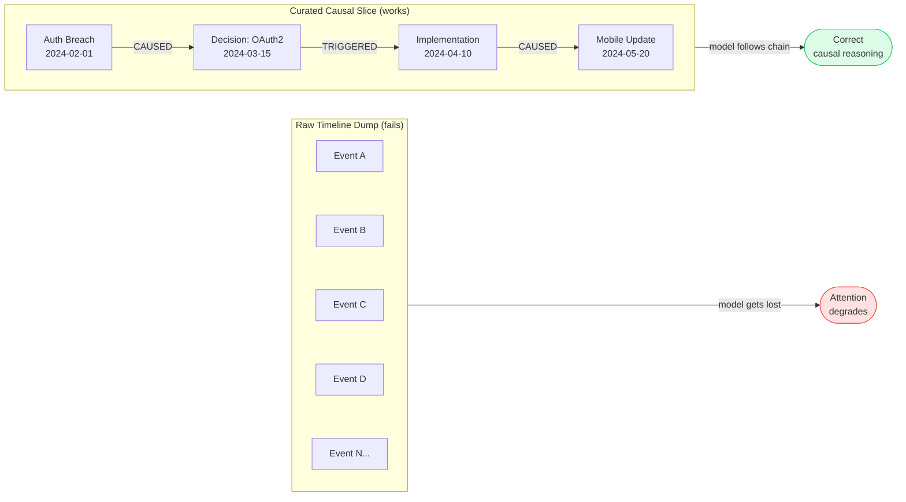
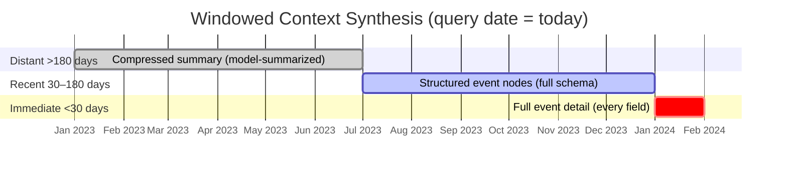

# Engineering Temporal Reasoning

## Why LLMs Struggle with Temporal Reasoning at Scale

LLMs have two temporal reasoning failure modes:

**1. Attention degradation**: When a long context contains hundreds of events in chronological order, attention distributes across the entire sequence. The model cannot reliably identify which events are causally linked vs. merely adjacent in time. "Lost in the middle" is the symptom.

**2. Context poisoning**: Events retrieved without their causal context contaminate reasoning. If you retrieve "auth service migrated to OAuth2" without "auth breach incident that caused it", the model may draw wrong conclusions about the migration's purpose.

The fix is not bigger context windows — it is structured temporal storage and targeted retrieval that feeds the model a *curated causal slice*, not a raw timeline dump.



---

## The Three Temporal Query Types

### Type 1: Sequence Queries
"What happened between A and B?"
- Retrieve all events in a time window for a set of entities
- Return in chronological order with timestamps
- Model synthesizes into a narrative

**Retrieval**: `SELECT events WHERE entity IN [...] AND timestamp BETWEEN A AND B ORDER BY timestamp`

---

### Type 2: Causal Queries
"What caused X?" or "What led to Y?"
- Start from a target event node
- Traverse `causal_predecessors` edges (up to N hops)
- Reconstruct the causal chain
- Model explains the chain

**Retrieval**: Graph traversal from target node, backwards along causal edges
```
MATCH (target:Event {id: 'evt_X'})
CALL apoc.path.subgraphNodes(target, {
  relationshipFilter: '<CAUSED',
  maxLevel: 4
}) YIELD node
RETURN node ORDER BY node.timestamp
```

---

### Type 3: Counterfactual Queries
"What if decision D had been different?"
- Retrieve the full causal subgraph downstream of the decision
- Feed it as structured context to the model
- Ask the model to reason about alternative outcomes

**Retrieval**: Forward traversal from decision node along `causal_successors` edges
**Note**: This is the hardest query type. Quality depends on how completely the causal graph was populated.

---

## Architecture Patterns for Temporal Reasoning

### Pattern 1: Event Graph with Timestamped Edges

Store every institutional event as a node. Link events with directed edges:
- `CAUSED` — event A directly caused event B
- `PRECEDED` — event A happened before B (temporal, not necessarily causal)
- `TRIGGERED` — event A triggered the initiation of process B
- `SUPERSEDED_BY` — event A was replaced by event B

Each edge carries a timestamp and an optional `rationale` property explaining the relationship.

This enables causal traversal (follow `CAUSED` edges) separately from temporal traversal (follow all edges ordered by timestamp).

---

### Pattern 2: Causal Chain Index

Maintain a pre-computed index of causal chains for high-frequency queries.

```
causal_chains/
├── auth-service/
│   ├── current_oauth2_adoption.chain.json    ← chain of events leading to current auth state
│   └── q3_cascade_incident.chain.json        ← events in/from the cascade failure
├── api-gateway/
│   └── ...
```

Each `.chain.json` is a linearized representation of the causal subgraph, updated when new events are added. For repeated queries about the same system's history, this avoids re-traversing the graph.

---

### Pattern 3: Windowed Context Synthesis

For long-horizon queries, compress distant history to fit context. Feed the model a tiered window — not a full dump:



```python
def build_temporal_context(events: list[Event], query_date: datetime) -> str:
    distant = [e for e in events if (query_date - e.timestamp).days > 180]
    recent = [e for e in events if 30 < (query_date - e.timestamp).days <= 180]
    immediate = [e for e in events if (query_date - e.timestamp).days <= 30]

    context = []
    if distant:
        context.append(f"[Historical summary — {len(distant)} events]")
        context.append(summarize_events(distant))   # model-compressed
    for e in recent:
        context.append(format_event_node(e))        # structured
    for e in immediate:
        context.append(format_event_full(e))        # full detail

    return "\n---\n".join(context)
```

Tune the 30/180 day boundaries based on your query distribution.

---

## Workflow: Answering a Causal Query

Given query: "What decisions led to us using [technology X]?"

1. **Identify the target event** — find the event node where X was adopted (graph lookup by tag/title)
2. **Traverse causal predecessors** — walk `CAUSED` and `TRIGGERED` edges backward (default: 4 hops)
3. **Collect the causal chain** — all ancestor events in topological order
4. **Apply windowed compression** if chain spans > 6 months
5. **Assemble structured context**:
   ```
   CAUSAL CHAIN FOR: [technology X adoption]
   ==========================================
   [Step 1 — oldest ancestor event]
   Date: ...  Actors: ...  What happened: ...  Why it mattered: ...

   [Step 2 → caused by Step 1]
   ...

   [Step N — adoption event]
   Date: ...  Decision: ...  Rationale: ...
   ```
6. **Query the model** with the structured chain + original user question
7. **Return narrative** explaining the causal chain in plain language

---

## References

- Temporal query patterns and graph schema → `references/temporal-patterns.md`
